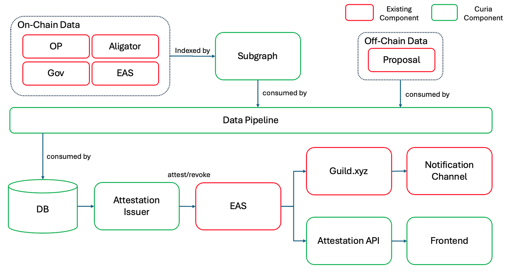

# System Architecture Overview

This is an overview of the Dynamic Attestation Architecture. Please note that this may change to adapt to future requirements.

## Components

### 1. **Subgraph**

The Subgraph indexes data from on-chain sources. It is chosen over an in-house indexer due to its flexibility and maintainability by the community. Subgraph is widely adopted across Web3 data communities.

#### Indexed Contracts

- **OP Contract**: Tracks voting power and delegate data.
- **Alligator Contract**: Provides partial delegation information.
- **Gov Contract**: Retrieves governance participation data.
- **EAS Contract**: Accesses attestation data for delegates.

### 2. **Data Pipeline**

The data pipeline consumes data from both the indexer and off-chain sources (e.g., proposals). It calculates the top 100 voting power delegates and stores this information in the database. The pipeline is implemented with:

- **GCP Cloud Run**
- **GCP Workflows** (for orchestration)

Additionally, the pipeline indexes off-chain data like proposal information to support new use case extensions.

### 3. **Frontend**

A web interface enables users to interact with the platform.

### 4. **Database**

Stores:

- Delegates' voting power
- Subdelegation rules

### 5. **Attestation Issuer**

A backend service responsible for issuing and revoking attestations to delegates.

## Workflow

### Daily Triggers

1. **Update Indexer**
   - Updates the indexer to ensure the latest data is available.
2. **Run Data Pipeline**
   - Fetches data from the indexer.
   - Calculates the top 100 delegates' voting power.

### Attestation Management

1. **Fetch Existing Attestations**
   - Checks conditions for revoking attestations.
2. **Revoke Non-Compliant Delegates**
   - Revokes attestations for delegates that do not meet the criteria.
3. **Issue New Attestations**
   - Issues attestations to the top new delegates.
4. **Update Roles**
   - Updates roles on **guild.xyz**.

### Data Storage and API

- All processed information is stored in the database.
- Data is accessible via:
  - API
  - User interface

---

This architecture ensures efficient and reliable processing of on-chain and off-chain data to support delegate management and governance operations.
